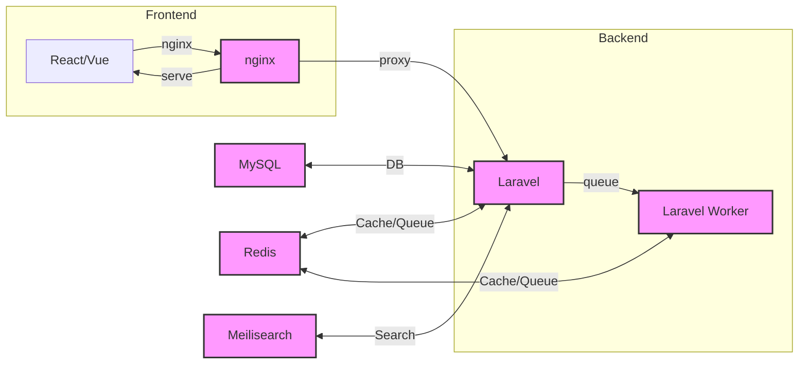

# Management-Pasar – One‑Command Install

## Pendahuluan
`Management-Pasar` merupakan aplikasi **Laravel** (backend) + **React/Vue** (frontend) yang dijalankan seluruhnya di dalam Docker. Paket ini menyediakan skrip **install**, **start**, **stop**, **restart**, **update**, **healthcheck**, dan **uninstall** sehingga pengguna dapat men‑deploy seluruh stack hanya dengan satu perintah:

```bash
git clone https://github.com/alumnisteman/Management-Pasar
cd Management-Pasar
./install.sh   # atau curl -fsSL https://.../install.sh | bash
```

> **Catatan:** Skrip ini mengasumsikan lingkungan Linux/WSL2 dengan `docker` & `docker‑compose` terpasang.

---
## Daftar Isi
- [Prasyarat](#prasyarat)
- [Instalasi](#instalasi)
- [Penggunaan Skrip](#penggunaan-skrip)
- [Variabel Lingkungan (`.env`)](#variabel-lingkungan)
- [Pembaruan (`make update`)](#pembaruan)
- [Uninstall](#uninstall)
- [Pemecahan Masalah](#pemecahan-masalah)
- [Arsitektur Stack](#arsitektur-stack)

---
## Prasyarat
| Tool | Versi minimal | Keterangan |
|------|----------------|------------|
| `docker` | 24.0+ | Engine Docker. |
| `docker compose` | v2.24+ | Bekerja dengan file `docker/docker-compose.yml`. |
| `curl` | 7.68+ | Digunakan oleh skrip instalasi. |
| `jq` | 1.6+ | Untuk parsing JSON (opsional). |
| `git` | 2.30+ | Hanya untuk `make update`. |

Jika salah satu tidak tersedia, instal via paket manager (apt, yum, brew).

---
## Instalasi
1. **Clone repository**
   ```bash
   git clone https://github.com/alumnisteman/Management-Pasar
   cd Management-Pasar
   ```
2. **Jalankan instalasi**
   ```bash
   ./install.sh
   ```
   Proses instalasi meliputi:
   - Deteksi OS & arsitektur.
   - Pemeriksaan dependensi (docker, docker‑compose, curl, jq).
   - Pembuatan file `.env` dari `.env.example` (dengan `APP_KEY` otomatis).
   - Pembuatan direktori `storage` & `bootstrap/cache` dengan permission `777`.
   - Build & `docker compose up -d --build` semua layanan.
   - Menunggu backend siap, kemudian melakukan migrasi database (`php artisan migrate`).
   - Opsional seeding (`SEED_DATABASE=true`).
   - Health‑check akhir dan menampilkan URL aplikasi.

> **Output contoh**
> ```
> ==========================================
> Instalasi selesai! Akses aplikasi di:
>    http://localhost
> ==========================================
> Perintah manajemen:
>    ./scripts/start.sh      # jalankan semua service
>    ./scripts/stop.sh       # matikan semua service
>    ./scripts/restart.sh    # restart
>    ./scripts/update.sh     # update ke versi terbaru
>    ./scripts/uninstall.sh  # hapus semua container & data (opsional)
> ```

---
## Penggunaan Skrip
| Skrip | Fungsi |
|------|--------|
| `install.sh` | Instalasi satu‑perintah (termasuk build, migrasi, seed, healthcheck). |
| `start.sh` | Menyalakan semua container (`docker compose up -d`). |
| `stop.sh` | Mematikan semua container (`docker compose down`). |
| `restart.sh` | `stop.sh` → `start.sh`. |
| `healthcheck.sh` | Menampilkan status health masing‑masing service serta URL aplikasi. |
| `update.sh` | Backup DB (opsional), `git pull`, rebuild container, migrasi, seed, healthcheck. |
| `uninstall.sh` | Menghapus semua container, jaringan, volume, serta file `.env` (opsional menghapus data volume). |

Semua skrip dapat dipanggil lewat **Makefile** untuk kemudahan:
```bash
make install    # sama dengan ./install.sh
make start      # ./scripts/start.sh
make stop       # ./scripts/stop.sh
make restart    # ./scripts/restart.sh
make healthcheck
make update
make uninstall
```

---
## Variabel Lingkungan (`.env`)
File `.env.example` berisi contoh lengkap.  Variabel penting:
```
APP_NAME=ManagementPasar
APP_ENV=production
APP_KEY=  # di‑generate otomatis saat install
APP_DEBUG=false
APP_URL=http://localhost

DB_CONNECTION=mysql
DB_HOST=management-pasar-mysql-1
DB_PORT=3306
DB_DATABASE=management_pasar
DB_USERNAME=root
DB_PASSWORD=secret

REDIS_HOST=management-pasar-redis-1
REDIS_PASSWORD=null
REDIS_PORT=6379

MEILISEARCH_HOST=management-pasar-meilisearch-1
MEILISEARCH_PORT=7700

SEED_DATABASE=false   # ubah menjadi true bila ingin seed data otomatis
DB_BACKUP_ON_UPDATE=false   # backup sebelum update (opsional)
```

Salin ke `.env` dan ubah nilai yang diperlukan sebelum menjalankan `install.sh`.

---
## Pembaruan (`make update`)
`make update` mengeksekusi `scripts/update.sh` yang:
1. **Backup DB** (jika `DB_BACKUP_ON_UPDATE=true`).
2. `git pull` untuk mengambil perubahan terbaru.
3. `docker compose pull && docker compose up -d --build` untuk memperbarui image.
4. Menjalankan migrasi dan optional seed.
5. Menjalankan health‑check.

---
## Uninstall
Gunakan `make uninstall` atau `./scripts/uninstall.sh`.  Skrip akan:
- `docker compose down -v` (menghapus container, network, dan volume).
- (Opsional) Menghapus volume data bila variabel `REMOVE_DATA_VOLUME=true`.
- Menghapus file `.env`.

---
## Pemecahan Masalah
| Gejala | Penyebab umum | Solusi |
|--------|---------------|-------|
| **Port 80/8000/4000 sudah dipakai** | Service lain berjalan pada port tersebut. | Matikan layanan yang memakai port atau ubah konfigurasi `docker-compose.yml`. |
| **Docker tidak terdeteksi** | Docker belum terinstall atau tidak berada pada `$PATH`. | Instal Docker, pastikan perintah `docker` dapat dijalankan. |
| **Container tidak sehat** | Konfigurasi DB, kredensial, atau volume yang korup. | Periksa log container (`docker logs <container>`), pastikan variabel `.env` sudah benar. |
| **Migrasi gagal** | Schema DB tidak sinkron atau hak akses DB terbatas. | Pastikan `DB_PASSWORD` sesuai, jalankan manual `docker exec <backend> php artisan migrate`. |
| **Frontend tidak dapat diakses** | Nginx tidak start atau port mapping salah. | Periksa `docker compose ps`, pastikan container `svms_nginx` dalam status `healthy`. |

---
## Arsitektur Stack


---
## Penutup
Dengan skrip dan dokumentasi ini, pengguna dapat **meng‑deploy** seluruh aplikasi `Management-Pasar` hanya dalam satu perintah, memperbarui, memeriksa kesehatan, serta meng‑uninstall bila diperlukan.

*Selamat mencoba!*
